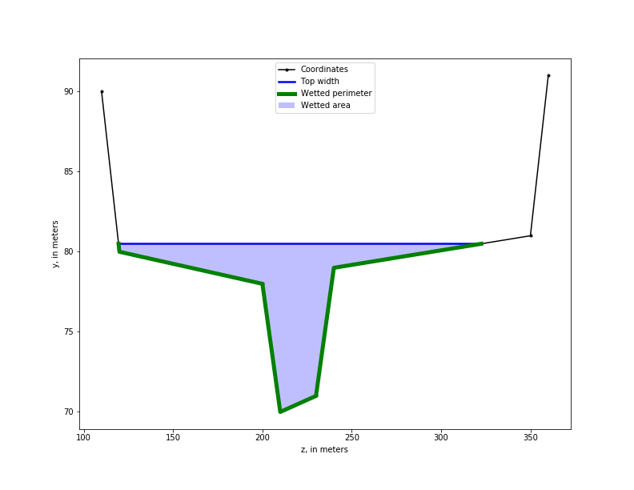

---
short-description: panthera docs
...

# panthera docs
Open-channel hydraulics library
```
/*
 *
 *               _   _                             _
 *   ___ ___ ___| |_| |_ ___ ___ ___ ___ _ _ ___ _| |_ _ ___
 *  | . | .'|   |  _|   | -_|  _| .'|___| | |   | . | | | -_|
 *  |  _|__,|_|_|_| |_|_|___|_| |__,|   |___|_|_|___|___|___|
 *  |_|
 *                                              Version 0.0.X
 *
 *                         Marian Domanski <mmdski@gmail.com>
 *
 */
```

[panthera GitHub project](https://github.com/mmdski/panthera-undue)

## Status
Normal depth computation using standard step method


Cross section plot



## Features

### Completed features
* Cross section computations
  * Area
  * Top width
  * Wetted perimeter
  * Hydraulic depth
  * Hydraulic radius
  * Conveyance
  * Velocity coefficient (energy flux correction coefficient)
  * Critical flow

### Planned features
* Steady flow
  * Normal
  * Gradually varied
    * Initial value
    * Boundary value
* Gradually varied unsteady flow
  * Method of characteristics

## Building and testing
### Linux
* Build requirements
  * GCC
  * Meson
  * Ninja (required by Meson)
* Test requirements
  * GLib
  * Valgrind

```
$ git clone https://github.com/mmdski/panthera-undue.git
$ cd panthera-undue
$ meson build
$ ninja -C build test
```

## Implementation notes
A goal of this project is for the code to also be natively compilable on
Windows. As a result, I'm using portable solutions. The only exception so far
is GLib for testing.

### Red-black BST
The cross section table implementation in panthera uses the red-black binary
search tree described in *[Algorithms](https://algs4.cs.princeton.edu/home/)*
by Robert Sedgewick and Kevin Wayne. The code was ported to C from their
[Java implementation](https://algs4.cs.princeton.edu/33balanced/RedBlackBST.java.html).
